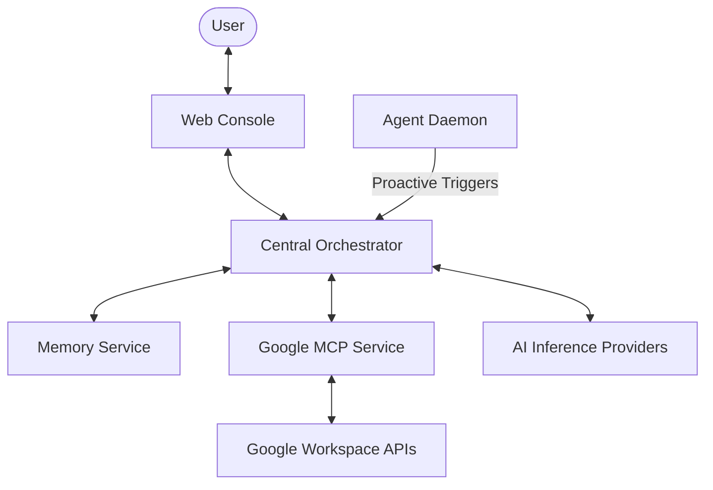
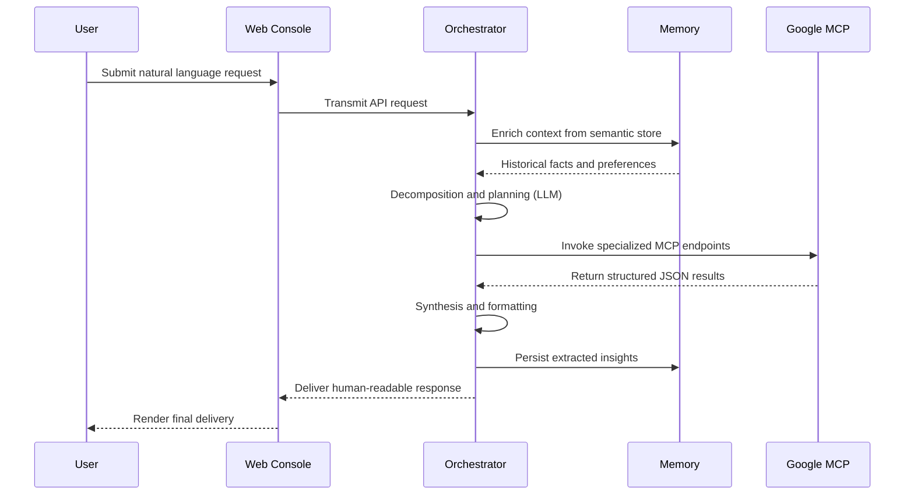

# ATLAS: Unified AI Orchestration Platform

[](https://github.com/GaneshBamalwa/ATLAS)
[](LICENSE)
[](docker-compose.yml)
[](https://fastapi.tiangolo.com/)
[](https://reactjs.org/)

ATLAS is a high-performance AI orchestration ecosystem engineered to bridge natural language reasoning with deterministic tool execution. It enables organizations to operationalize large language models through a structured, observable, and extensible microservice architecture.

Designed for enterprise-grade deployments, ATLAS combines advanced reasoning frameworks, secure integrations, and real-time execution visibility into a single cohesive platform.

---

## Table of Contents

- [Overview](#overview)
- [Core Capabilities](#core-capabilities)
- [System Architecture](#system-architecture)
- [Execution Workflow](#execution-workflow)
- [Technology Stack](#technology-stack)
- [Getting Started](#getting-started)
    - [Prerequisites](#prerequisites)
    - [Quick Start](#quick-start-recommended)
    - [Local Development](#local-development-mode)
- [Design Principles](#design-principles)
- [Documentation](#documentation)

---

## Overview

ATLAS functions as an intelligent coordination layer between users, AI models, and external systems. It translates natural language into multi-step execution plans, invokes the appropriate services, and synthesizes results into structured, human-readable responses.

The platform is built on a distributed architecture where a central orchestrator governs specialized services, enabling scalability, modularity, and resilience. Unlike traditional chatbots, ATLAS is an operational layer designed for multi-system automation.

---

## Core Capabilities

### Central Orchestration Engine
The orchestrator serves as the system’s cognitive core. It interprets intent, plans execution strategies, and coordinates tool interactions through a structured reasoning loop. It supports multi-step workflows, dynamic tool selection, and context-aware decision-making.

### Unified Google MCP Integration
ATLAS provides a standardized Model Context Protocol layer for seamless interaction with Google Workspace services. This includes Gmail, Drive, and Calendar, all secured through OAuth2 and exposed via a unified interface.

### Autonomous Agent Daemon
A proactive intelligence layer continuously monitors user context and external signals. It identifies opportunities for intervention and generates actionable suggestions without requiring explicit user prompts.

### Persistent Memory Layer
ATLAS incorporates a semantic memory system that captures user preferences, contextual facts, and historical interactions. This enables continuity, personalization, and improved reasoning over time.

### Execution Trace Observability
A real-time visualization system exposes the internal reasoning and execution flow of the orchestrator. This includes tool selection, payload inspection, and step-by-step traceability for debugging and auditing.

---

## System Architecture

ATLAS follows a distributed microservice design, separating responsibilities across independent yet coordinated services.



### Core Components

| Component | Port | Description |
| :--- | :--- | :--- |
| **Orchestrator** | 9000 | The reasoning engine responsible for routing, planning, execution, and response synthesis. |
| **Google MCP Service** | 8000 | A protocol-compliant bridge that translates orchestrator actions into Google API operations. |
| **Memory Service** | 9100 | A semantic storage layer for contextual retrieval and long-term learning. |
| **Agent Daemon** | 9001 | A background service that enables proactive intelligence and event-driven behavior. |
| **Web Console** | 5173 | A React-based frontend providing interaction, observability, and system control. |

---

## Execution Workflow

The orchestration lifecycle follows a rigorous path from ingestion to persistence:



---

## Technology Stack

| Layer | Technologies |
| :--- | :--- |
| **Frontend** | React, Vite, Tailwind CSS, ShadCN UI |
| **Backend** | FastAPI, LangChain / LangGraph |
| **AI Providers** | Groq (LLaMA 3), OpenAI (GPT-4o), Claude Sonnet |
| **Infrastructure** | Docker, Redis, ChromaDB |
| **Authentication** | Google OAuth 2.0 |

---

## Getting Started

### Prerequisites
- Docker and Docker Compose
- Python 3.10+
- Node.js with pnpm
- Google Cloud credentials (`credentials.json`)

### Quick Start (Recommended)
The most efficient way to deploy the full ATLAS stack is via Docker Compose:

```bash
docker-compose up --build
```
Once initialized, access the web console at: `http://localhost:5173`

### Local Development Mode
For granular control, services can be executed independently. Ensure dependencies are installed for each service.

#### 1. Orchestrator
```bash
cd services/orchestrator
uvicorn app.main:app --reload --port 9000
```

#### 2. Google MCP
```bash
cd services/google-mcp
uvicorn backend.main:app --reload --port 8000
```

#### 3. Memory Service
```bash
cd services/memory
uvicorn app.main:app --reload --port 8002
```

#### 4. Agent Daemon
```bash
cd services/agent-daemon
uvicorn app.main:app --reload --port 9001
```

#### 5. Web Console
```bash
cd apps/web-console
pnpm install
pnpm run dev
```

---

## Design Principles

ATLAS is built around a set of foundational principles to ensure industrial-grade reliability:

- **Deterministic Execution**: Prioritizing structured tool outputs over probabilistic model responses.
- **Transparent Reasoning**: Complete traceability of all internal decisions and tool payloads.
- **Service-Oriented Architecture**: Modular components that can be scaled or replaced independently.
- **Secure Integration**: User-scoped authorization with strict OAuth2 boundaries.
- **Continuous Learning**: Augmenting static model weights with dynamic semantic memory.

---

## Documentation

For detailed technical specifications and deployment guides, refer to the following resources:

- [Architecture Overview](./architecture.md)
- [Feature Registry](./features.md)
- [Startup Guide](./startup.md)
- [Technical Specifications](./details.md)

---

> [!IMPORTANT]
> ATLAS is not a chatbot. It is an orchestration layer for operational AI, enabling seamless, multi-system automation with total visibility and control.
