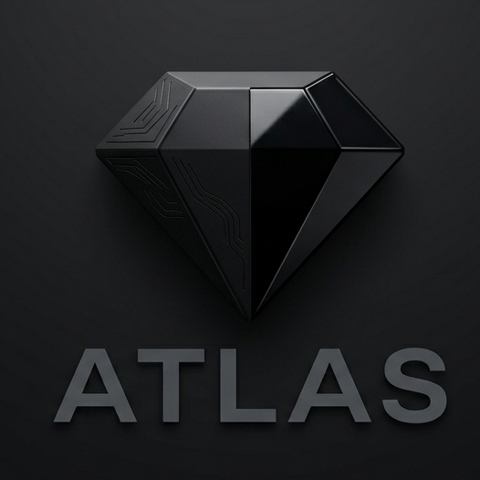
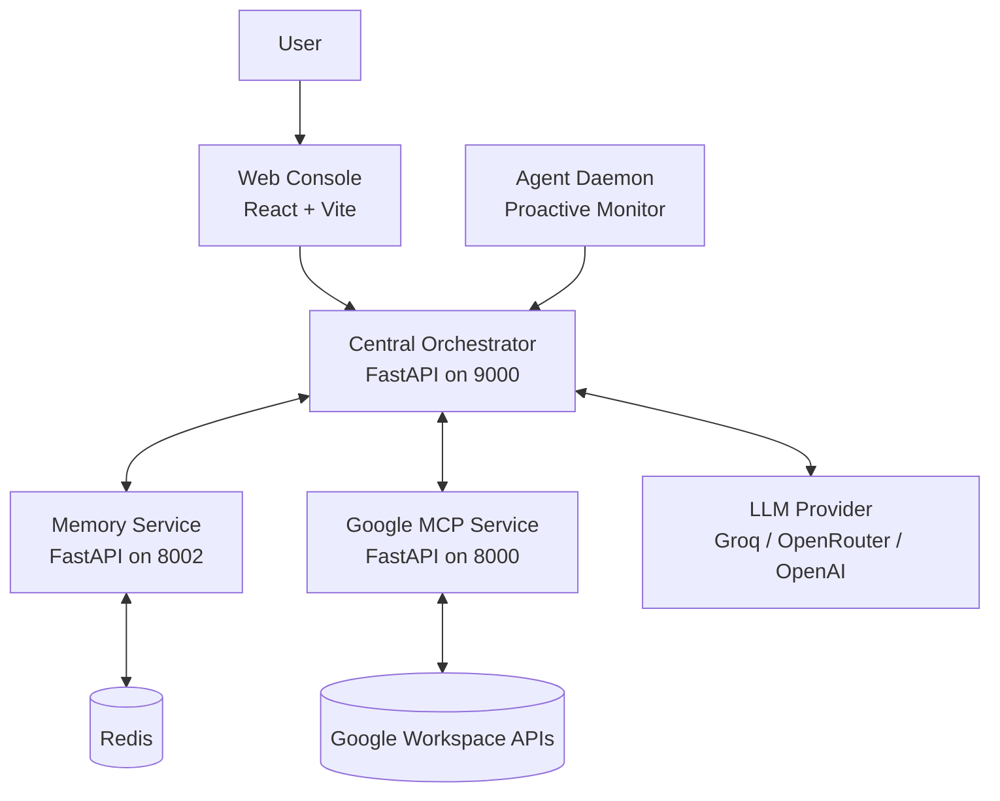
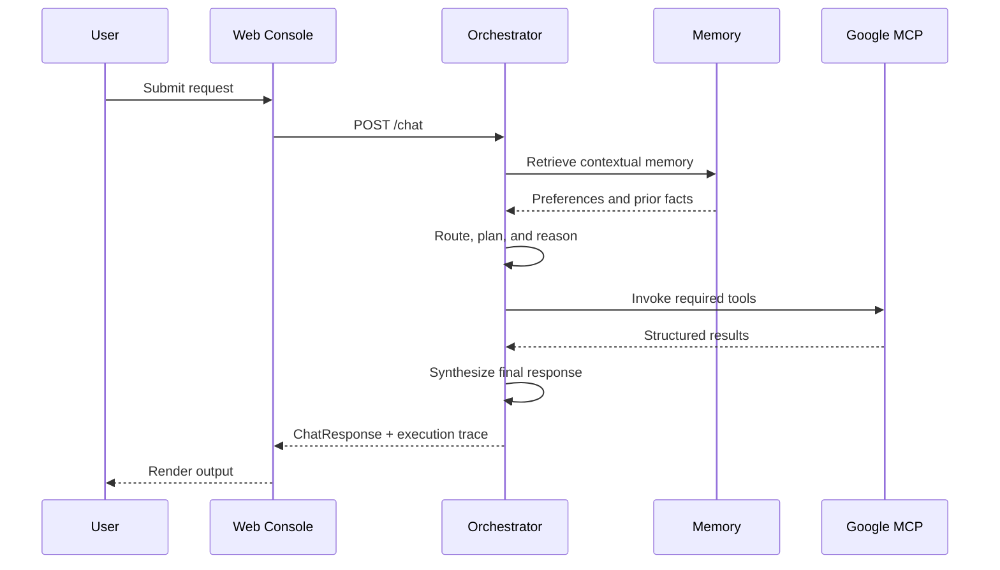

<br/>

<p align="center">
  
</p>
<p align="center">
  Enterprise AI Orchestration Platform
</p>

<br/>

[](LICENSE)
[](architecture.md)
[](services/orchestrator)
[](apps/web-console)
[](apps/web-console)
[](docker-compose.yml)
[](services/google-mcp)

ATLAS is a distributed AI orchestration platform for teams that need deterministic tool execution, observable reasoning, and enterprise-grade Google Workspace automation. It turns natural language requests into structured workflows, executes them across specialized services, and returns polished responses with full trace visibility.

The platform is organized around a central orchestrator, a unified Google MCP service, persistent memory, a proactive agent daemon, and a React-based web console. The result is a system that behaves more like an operational control plane than a chat app.

## At A Glance

| Capability | What It Delivers |
| :-- | :-- |
| Orchestration | Intent routing, multi-step planning, tool selection, and response synthesis. |
| Google automation | Gmail, Drive, and Calendar actions through a unified MCP layer. |
| Memory | Persistent semantic context for personalization and continuity. |
| Proactive behavior | Background monitoring and event-driven suggestions. |
| Observability | Traceable execution paths and inspectable request/response payloads. |

## Platform Map



## Request Lifecycle



## Core Services

| Service | Port | Responsibility |
| :-- | :-- | :-- |
| Web Console | 5173 in dev, 3000 in Docker | Chat UI, markdown rendering, and trace inspection. |
| Orchestrator | 9000 | Core reasoning, routing, tool execution, and response formatting. |
| Google MCP | 8000 | Google Workspace bridge for Gmail, Drive, and Calendar. |
| Memory | 8002 | Semantic persistence and contextual retrieval. |
| Agent Daemon | 9001 | Background monitoring and proactive triggers. |
| Redis | 6379 | Queueing and shared state support. |

## Feature Set

| Area | Highlights |
| :-- | :-- |
| Reasoning | ReAct-style orchestration, multi-step planning, and tool chaining. |
| Integrations | Gmail intelligence, Drive search, Calendar scheduling, and OAuth-backed access. |
| UX | Real-time chat, execution traces, and persistent session state. |
| Reliability | Structured responses, service separation, and explicit timeouts/retries. |
| Memory | Long-term context storage and preference-aware behavior. |

## Technology Stack

| Layer | Stack |
| :-- | :-- |
| Frontend | React, TypeScript, Vite, Tailwind CSS, React Markdown |
| Backend | FastAPI, Python, async HTTP clients |
| Orchestration | LangGraph-style runtime and internal routing pipelines |
| Infrastructure | Docker, Redis, ChromaDB |
| Integrations | Google OAuth 2.0, Google Workspace APIs |

## Repository Layout

```text
ATLAS/
├── apps/
│   └── web-console/        # React frontend and chat UI
├── services/
│   ├── orchestrator/       # Core reasoning and response synthesis
│   ├── google-mcp/         # Google Workspace MCP bridge
│   ├── memory/             # Semantic memory service
│   └── agent-daemon/       # Proactive background intelligence
├── architecture.md         # System design overview
├── details.md              # Technical specifications
├── features.md             # Feature registry
├── startup.md              # Deployment and startup guide
└── docker-compose.yml      # Full-stack local deployment
```

## Quick Start

### Prerequisites

| Requirement | Notes |
| :-- | :-- |
| Docker and Docker Compose | Recommended for full-stack local runs. |
| Python 3.10+ | Required for the backend services. |
| Node.js 18+ and pnpm | Required for the web console. |
| Google Cloud credentials | Place `credentials.json` in the Google MCP service. |

### 1. Configure Environment

Start from `example.env` and create your local `.env` file in the project root.

Key variables:

| Variable | Purpose |
| :-- | :-- |
| `GROQ_API_KEY` | Backup LLM provider key. |
| `OPENROUTER_API_KEY` | Primary LLM provider key in the example config. |
| `LLM_MODEL` | Model identifier used by the orchestrator. |
| `LLM_BASE_URL` | Provider API base URL. |
| `ORCHESTRATOR_PORT` | Orchestrator runtime port. |
| `ALLOWED_ORIGINS` | Permitted browser origins for local development. |
| `GOOGLE_CLIENT_SECRETS_JSON` | Google OAuth client secrets file. |

### 2. Run With Docker

```bash
docker-compose up --build
```

Open the web console at `http://localhost:3000`.

### 3. Run Services Locally

Orchestrator:

```bash
cd services/orchestrator
uvicorn app.main:app --reload --port 9000
```

Google MCP:

```bash
cd services/google-mcp
uvicorn backend.main:app --reload --port 8000
```

Memory:

```bash
cd services/memory
uvicorn app.main:app --reload --port 8002
```

Agent Daemon:

```bash
cd services/agent-daemon
uvicorn app.main:app --reload --port 9001
```

Web Console:

```bash
cd apps/web-console
pnpm install
pnpm run dev
```

## Operational Notes

| Topic | Detail |
| :-- | :-- |
| Markdown rendering | Responses are rendered directly in the web console with React Markdown and GFM support. |
| Session persistence | Chat state is stored locally so navigation does not clear the conversation. |
| Execution traces | The UI exposes orchestration steps for debugging and auditability. |
| Integrations | Google Workspace actions are routed through the MCP service rather than being called directly from the browser. |

## Documentation

| File | Use |
| :-- | :-- |
| [architecture.md](architecture.md) | System topology and service boundaries. |
| [features.md](features.md) | Capability inventory and platform features. |
| [startup.md](startup.md) | Deployment paths and service startup instructions. |
| [details.md](details.md) | Technical specifications, ports, and security model. |

## Design Principles

ATLAS is built around a few non-negotiable principles:

- Deterministic execution over opaque behavior.
- Clear service boundaries and explicit data flow.
- Human-readable output with traceable provenance.
- Secure, user-scoped Google Workspace integration.
- Persistent memory for continuity and personalization.

## Positioning

ATLAS is an orchestration layer for operational AI, not a generic chatbot. It is designed to coordinate systems, preserve context, and surface execution detail with enough structure for enterprise use.
