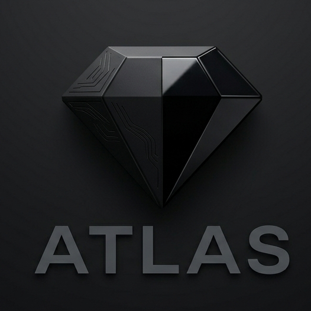
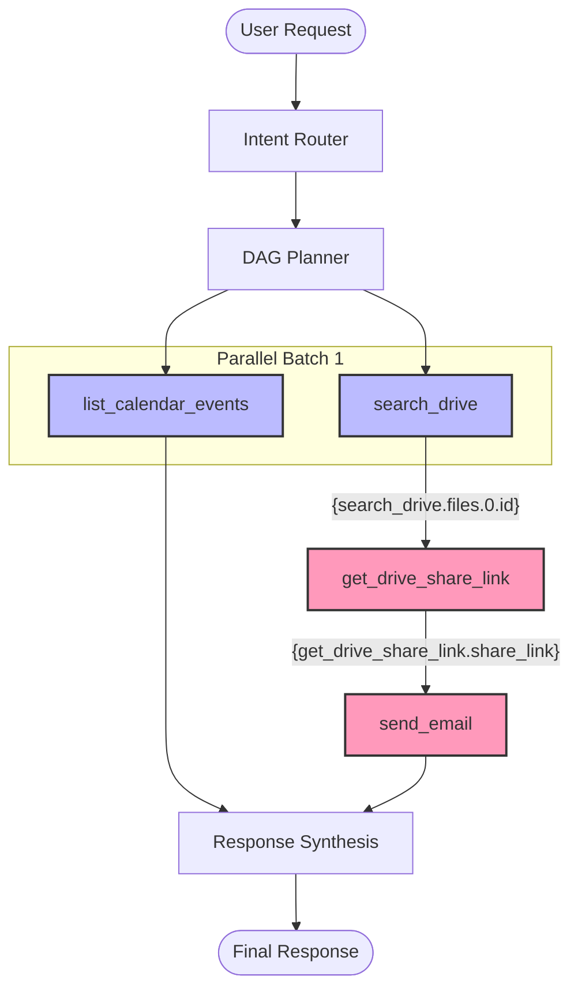
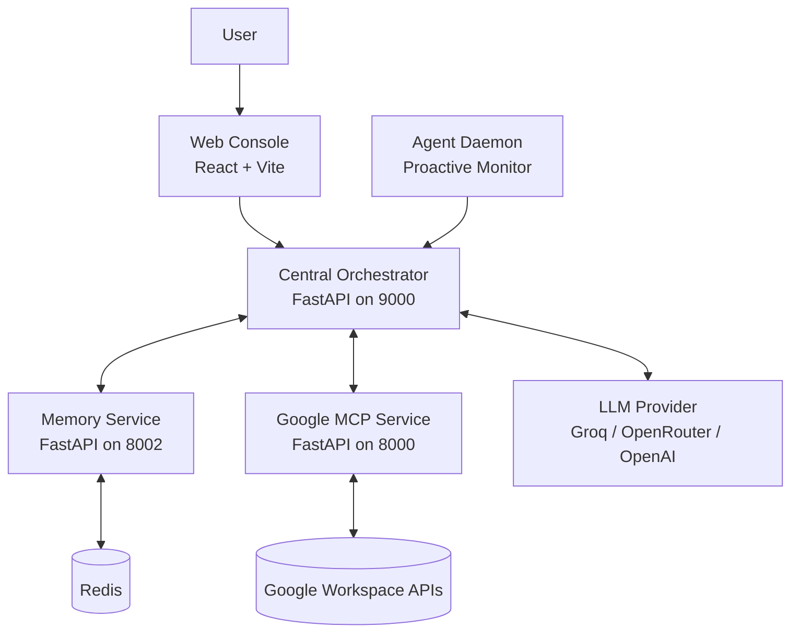

<br/>

<p align="center">
  
</p>
<p align="center">
  Enterprise AI Orchestration Platform
</p>

<br/>

[](https://github.com/GaneshBamalwa/ATLAS)
[](LICENSE)
[](services/orchestrator)
[](apps/web-console)
[](services/google-mcp)

ATLAS is a distributed AI orchestration platform for teams that need deterministic tool execution, observable reasoning, and enterprise-grade Google Workspace automation. It turns natural language requests into structured workflows, executes them across specialized services, and returns polished responses with full trace visibility.

---

## 🚀 Execution Engine Evolution & Latency Reduction

ATLAS has evolved from a simple sequential execution model to a high-performance **Directed Acyclic Graph (DAG) Parallel Execution Engine**.

### Previous Architecture: Sequential Execution (25-30s latency)
In the previous version, the orchestrator executed all planned tools one after the other. Even if tools were completely independent (e.g. searching Google Drive and listing calendar events), the system blocked execution, executing each tool synchronously. This resulted in an average response time of **25 to 30 seconds**.


```mermaid
graph LR
    User([User Request]) --> Router[Intent Router]
    Router --> Planner[Planner]
    Planner --> Exec1[search_drive]
    Exec1 --> Exec2[get_drive_share_link]
    Exec2 --> Exec3[list_calendar_events]
    Exec3 --> Exec4[send_email]
    Exec4 --> Synthesis[Response Synthesis]
    Synthesis --> End([Final Response])
    style Exec1 fill:#f9f,stroke:#333,stroke-width:2px
    style Exec2 fill:#f9f,stroke:#333,stroke-width:2px
    style Exec3 fill:#f9f,stroke:#333,stroke-width:2px
    style Exec4 fill:#f9f,stroke:#333,stroke-width:2px
```

### Current Architecture: DAG Parallel Execution (10-15s latency)
The current engine analyzes dependencies between tool parameters (using `{tool_name.field}` references). 
1. **Parallel Execution Blocks:** Independent tools are grouped into batches and fired simultaneously using `asyncio.gather`.
2. **Sequential Dependency Pipelines:** Dependent tools wait only for their direct ancestors to complete.
3. **Execution Latency:** Total execution time is reduced to `max(critical_path_latency)` rather than `sum(all_latencies)`. Average response time is now **10 to 15 seconds** (a **50%+ speedup**).


```mermaid
graph TD
    User([User Request]) --> Router[Intent Router]
    Router --> Planner[DAG Planner]
    
    subgraph Parallel Batch 1
        Exec1[search_drive]
        Exec3[list_calendar_events]
    end
    
    Planner --> Exec1
    Planner --> Exec3
    
    Exec1 -->|"{search_drive.files.0.id}"| Exec2[get_drive_share_link]
    Exec2 -->|"{get_drive_share_link.share_link}"| Exec4[send_email]
    
    Exec3 --> Synthesis[Response Synthesis]
    Exec4 --> Synthesis
    Synthesis --> End([Final Response])
    
    style Exec1 fill:#bbf,stroke:#333,stroke-width:2px
    style Exec3 fill:#bbf,stroke:#333,stroke-width:2px
    style Exec2 fill:#f9b,stroke:#333,stroke-width:2px
    style Exec4 fill:#f9b,stroke:#333,stroke-width:2px
```

---

## 📊 Feature Set & Improvements

* **Live Execution Graph:** Renders real-time DAG nodes and interactive connection lines in the frontend console via ReactFlow. Click nodes to inspect inputs/outputs, latency, and status.
* **Temporal Context Injection:** Prompt engines automatically receive the current calendar date and weekday, enabling accurate planning for relative queries (e.g. *"tomorrow at 6pm"*).
* **Time-Ranged Bulk Calendar Clearing:** Instantly clear a full day's meetings or select specific timeframes (e.g. *"clear my afternoon between 2pm and 5pm"*).
* **Integrations UX State-Locking:** Eliminates confusion on the Integrations page by displaying only the `Connect` option when logged out, and only the `Disconnect` option when authenticated.

---

## 🗺️ Platform Map


```mermaid
graph TD
    User[User] --> WebConsole[Web Console\nReact + Vite]
    WebConsole --> Orchestrator[Central Orchestrator\nFastAPI on 9000]
    Orchestrator <--> Memory[Memory Service\nFastAPI on 8002]
    Orchestrator <--> GoogleMCP[Google MCP Service\nFastAPI on 8000]
    Agent[Agent Daemon\nProactive Monitor] --> Orchestrator
    Memory <--> Redis[(Redis)]
    GoogleMCP <--> GoogleAPIs[(Google Workspace APIs)]
    Orchestrator <--> LLM[LLM Provider\nGroq / OpenRouter / OpenAI]
```

---

## ⚙️ Core Services

| Service | Port | Responsibility |
| :-- | :-- | :-- |
| **Web Console** | 5173 | Chat panel UI, ReactFlow execution graph page, OAuth integration controls. |
| **Orchestrator** | 9000 | Compiles intent DAGs, resolves tool output placeholers, manages step telemetry. |
| **Google MCP** | 8000 | Performs Gmail queries, Drive access, and Google Calendar operations via API. |
| **Memory** | 8002 | Stores short-term and long-term user preferences via ChromaDB. |
| **Agent Daemon** | 9001 | Handles passive/proactive triggers. |

---

## 🚀 Quick Start

### 1. Configure Environment
Create a `.env` file in the root directory:
```bash
cp .env.example .env
```

### 2. Run Local Environment
Ensure you have Docker and Docker Compose installed:
```bash
# Start all services
docker-compose up --build
```
Open [http://localhost:3000](http://localhost:3000) to access the console.

### 3. Run Manually (Local Dev)
```bash
# Start Google MCP
cd services/google-mcp && uvicorn backend.main:app --reload --port 8000

# Start Orchestrator
cd services/orchestrator && uvicorn app.main:app --reload --port 9000

# Start Frontend Console
cd apps/web-console && pnpm install && pnpm dev
```
