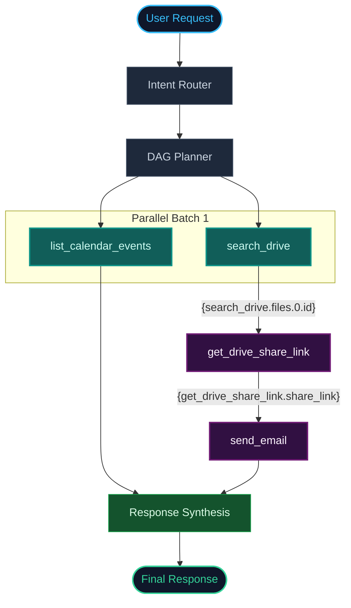
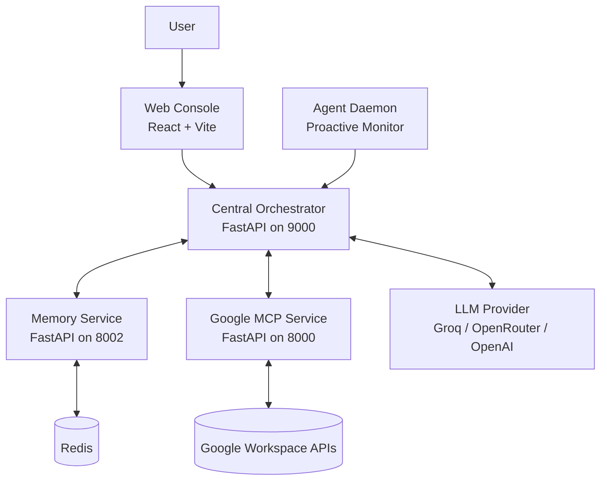

<br/>

<p align="center">
  
</p>
<p align="center">
  Enterprise AI Orchestration Platform
</p>

<br/>

[](https://github.com/GaneshBamalwa/ATLAS)
[](LICENSE)
[](services/orchestrator)
[](apps/web-console)
[](services/google-mcp)

ATLAS is a distributed AI orchestration platform for teams that need deterministic tool execution, observable reasoning, and enterprise-grade Google Workspace automation. It turns natural language requests into structured workflows, executes them across specialized services, and returns polished responses with full trace visibility.

---

## 🚀 Execution Engine Evolution & Latency Reduction

ATLAS has evolved from a simple sequential execution model to a high-performance **Directed Acyclic Graph (DAG) Parallel Execution Engine**.

### Previous Architecture: Sequential Execution (25-30s latency)
In the previous version, the orchestrator executed all planned tools one after the other. Even if tools were completely independent (e.g. searching Google Drive and listing calendar events), the system blocked execution, executing each tool synchronously. This resulted in an average response time of **25 to 30 seconds**.


```mermaid
graph LR
    User([User Request]) --> Router[Intent Router]
    Router --> Planner[Planner]
    Planner --> Exec1[search_drive]
    Exec1 --> Exec2[get_drive_share_link]
    Exec2 --> Exec3[list_calendar_events]
    Exec3 --> Exec4[send_email]
    Exec4 --> Synthesis[Response Synthesis]
    Synthesis --> End([Final Response])

    style User fill:#0f172a,stroke:#38bdf8,color:#38bdf8,stroke-width:2px
    style Router fill:#1e293b,stroke:#475569,color:#cbd5e1,stroke-width:1px
    style Planner fill:#1e293b,stroke:#475569,color:#cbd5e1,stroke-width:1px
    style Exec1 fill:#881337,stroke:#be123c,color:#fda4af,stroke-width:2px
    style Exec2 fill:#881337,stroke:#be123c,color:#fda4af,stroke-width:2px
    style Exec3 fill:#881337,stroke:#be123c,color:#fda4af,stroke-width:2px
    style Exec4 fill:#881337,stroke:#be123c,color:#fda4af,stroke-width:2px
    style Synthesis fill:#1e293b,stroke:#475569,color:#cbd5e1,stroke-width:1px
    style End fill:#0f172a,stroke:#34d399,color:#34d399,stroke-width:2px
```

### Current Architecture: DAG Parallel Execution (10-15s latency)
The current engine analyzes dependencies between tool parameters (using `{tool_name.field}` references). 
1. **Parallel Execution Blocks:** Independent tools are grouped into batches and fired simultaneously using `asyncio.gather`.
2. **Sequential Dependency Pipelines:** Dependent tools wait only for their direct ancestors to complete.
3. **Execution Latency:** Total execution time is reduced to `max(critical_path_latency)` rather than `sum(all_latencies)`. Average response time is now **10 to 15 seconds** (a **50%+ speedup**).


```mermaid
graph TD
    User([User Request]) --> Router[Intent Router]
    Router --> Planner[DAG Planner]
    
    subgraph Parallel Batch 1
        Exec1[search_drive]
        Exec3[list_calendar_events]
    end
    
    Planner --> Exec1
    Planner --> Exec3
    
    Exec1 -->|"{search_drive.files.0.id}"| Exec2[get_drive_share_link]
    Exec2 -->|"{get_drive_share_link.share_link}"| Exec4[send_email]
    
    Exec3 --> Synthesis[Response Synthesis]
    Exec4 --> Synthesis
    Synthesis --> End([Final Response])
    
    style User fill:#0f172a,stroke:#38bdf8,color:#38bdf8,stroke-width:2px
    style Router fill:#1e293b,stroke:#475569,color:#cbd5e1,stroke-width:1px
    style Planner fill:#1e293b,stroke:#475569,color:#cbd5e1,stroke-width:1px
    
    style Exec1 fill:#115e59,stroke:#0d9488,color:#ccfbf1,stroke-width:2px
    style Exec3 fill:#115e59,stroke:#0d9488,color:#ccfbf1,stroke-width:2px
    
    style Exec2 fill:#311042,stroke:#701a75,color:#fdf4ff,stroke-width:2px
    style Exec4 fill:#311042,stroke:#701a75,color:#fdf4ff,stroke-width:2px
    
    style Synthesis fill:#14532d,stroke:#16a34a,color:#dcfce7,stroke-width:1px
    style End fill:#0f172a,stroke:#34d399,color:#34d399,stroke-width:2px
```

---

## 🧠 Deep Dive: Dependent vs. Independent DAG Orchestration

The core value of the ATLAS v2.0 engine lies in how it parses, structures, and executes tasks using a custom-built Directed Acyclic Graph (DAG) executor.

### 1. Dependency Analysis & Planning
When a user submits a prompt, the orchestrator asks the DAG Planner (powered by Groq) to output a structured JSON plan. The planner determines the exact tool dependencies by looking at whether one tool's input parameters rely on the output of a prior tool.

* **Independent Tools:** Have no unresolved parameters and no parents listed in `dependencies`. They can execute immediately.
* **Dependent Tools:** Contain placeholders like `{search_drive.files.0.id}` in their inputs and declare the source tool (e.g., `search_drive`) as a dependency.

#### JSON Execution Plan Example:
```json
[
  {
    "tool": "search_drive",
    "arguments": {
      "query": "Hack2Skill presentation"
    },
    "dependencies": []
  },
  {
    "tool": "get_drive_share_link",
    "arguments": {
      "file_id": "{search_drive.files.0.id}"
    },
    "dependencies": ["search_drive"]
  },
  {
    "tool": "add_calendar_event",
    "arguments": {
      "summary": "Hack2Skill Project Sync",
      "date": "2026-05-24",
      "start_time": "18:00"
    },
    "dependencies": []
  }
]
```

### 2. Runtime Dependency Resolution
During execution, the DAG runtime builds a task dependency tree.
1. **First Wave (Parallel):** Both `search_drive` and `add_calendar_event` are dispatched in parallel.
2. **Dynamic Interpolation:** Once `search_drive` finishes, its actual output (e.g., `{"files": [{"id": "1abcde..."}]}`) is cached.
3. **Triggering Downstreams:** The engine searches for pending tools depending on `search_drive`. It resolves the placeholder `{search_drive.files.0.id}` to `"1abcde..."`, updates the parameters for `get_drive_share_link`, and immediately triggers it.
4. **Final Chaining:** Once the share link is retrieved, it resolves any downstream tool using that link (e.g., an email body) and executes it.

---

## 📊 Live Flow Visualizer (ReactFlow Engine)

ATLAS maps this execution state directly to an interactive, node-based Flow Visualizer built on **ReactFlow** and **Framer Motion**.

### Visual Layout & Depths
Rather than displaying a flat vertical list or a basic text trace, the visualizer maps the DAG's topological order into coordinates:
* **Horizontal Alignment (Parallelism):** Nodes that have the same dependency depth are positioned side-by-side. If three tools are executing independently, they appear in a horizontal row, visually communicating concurrent execution.
* **Vertical Stacking (Sequence):** Nodes with dependencies are positioned directly underneath their parent nodes, connected by smooth SVG cubic-bezier edges.

### Live Node Interactivity
Each node in the graph is a custom component designed to give complete observability:
* **Color-Coded Statuses:** 
  * `Idle` (Gray): Waiting for upstream execution.
  * `Running` (Pulsating Blue): Currently executing.
  * `Success` (Green): Execution complete.
  * `Failed` (Red): Click to inspect error.
* **Click-to-Inspect Drawer:** Clicking any node slides open a detailed telemetry drawer displaying the exact input payload, return JSON, execution duration (ms), and any network logs.

---

## 🗺️ Platform Map


```mermaid
graph TD
    User[User] --> WebConsole[Web Console\nReact + Vite]
    WebConsole --> Orchestrator[Central Orchestrator\nFastAPI on 9000]
    Orchestrator <--> Memory[Memory Service\nFastAPI on 8002]
    Orchestrator <--> GoogleMCP[Google MCP Service\nFastAPI on 8000]
    Agent[Agent Daemon\nProactive Monitor] --> Orchestrator
    Memory <--> Redis[(Redis)]
    GoogleMCP <--> GoogleAPIs[(Google Workspace APIs)]
    Orchestrator <--> LLM[LLM Provider\nGroq / OpenRouter / OpenAI]
```

---

## ⚙️ Core Services

| Service | Port | Responsibility |
| :-- | :-- | :-- |
| **Web Console** | 5173 | Chat panel UI, ReactFlow execution graph page, OAuth integration controls. |
| **Orchestrator** | 9000 | Compiles intent DAGs, resolves tool output placeholders, manages step telemetry. |
| **Google MCP** | 8000 | Performs Gmail queries, Drive access, and Google Calendar operations via API. |
| **Memory** | 8002 | Stores short-term and long-term user preferences via ChromaDB. |
| **Agent Daemon** | 9001 | Handles passive/proactive triggers. |

---

## 🚀 Quick Start

### 1. Configure Environment
Create a `.env` file in the root directory:
```bash
cp .env.example .env
```

### 2. Run Local Environment
Ensure you have Docker and Docker Compose installed:
```bash
# Start all services
docker-compose up --build
```
Open [http://localhost:3000](http://localhost:3000) to access the console.

### 3. Run Manually (Local Dev)
```bash
# Start Google MCP
cd services/google-mcp && uvicorn backend.main:app --reload --port 8000

# Start Orchestrator
cd services/orchestrator && uvicorn app.main:app --reload --port 9000

# Start Frontend Console
cd apps/web-console && pnpm install && pnpm dev
```
